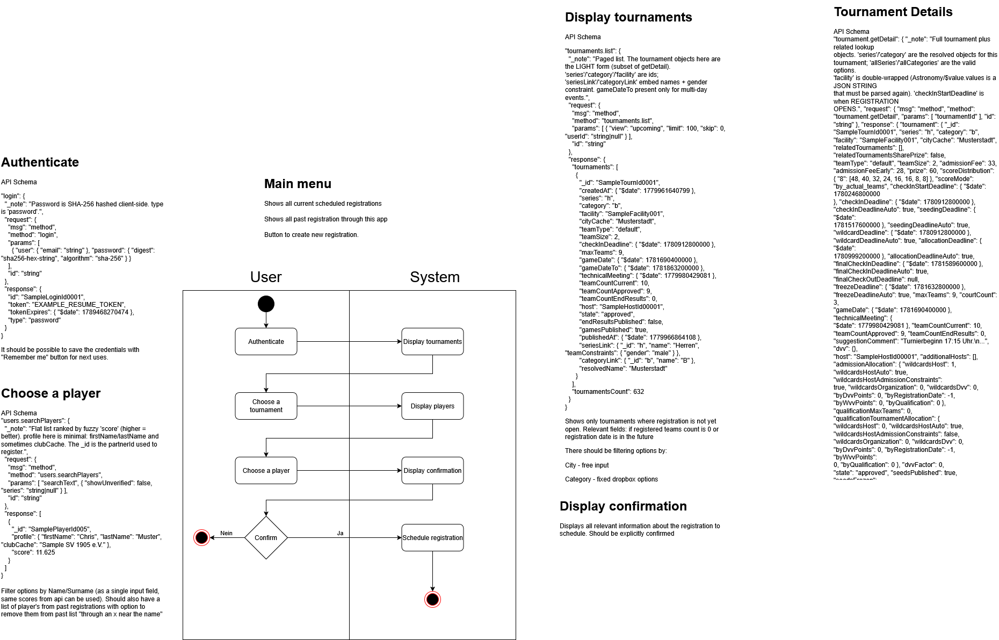

# BeachBot

A Windows desktop app that automates signing up for beach‑volleyball tournaments on
[beachvolleyball.nrw](https://www.beachvolleyball.nrw/). You log in, browse upcoming
events, pick a partner, and schedule a registration — the app then submits it the
moment registration opens, so you don't have to be at your keyboard at the exact
minute a popular tournament fills up.

It started as a personal tool and is published here as a portfolio project. It's built
around a clean, layered architecture with a hand‑written client for the site's
real‑time protocol.

> **Note:** every registration is reviewed and explicitly confirmed by you before it is
> scheduled — nothing is submitted without your confirmation.

## Highlights

- **No public API — so the client talks the site's protocol directly.** beachvolleyball.nrw
  is a [Meteor](https://www.meteor.com/) app: there is no REST/HTTP API and no cookies.
  The backend speaks **DDP over a raw WebSocket**, so `BeachBot.Api` implements a small
  DDP client from scratch (`ClientWebSocket` + connect handshake + request/response
  correlation by message id).
- **Clean, testable layering.** A dependency‑free domain core, an isolated protocol/API
  layer, an application layer for use‑cases, and a thin WPF front‑end — wired together by
  hand (no DI container), so the whole object graph is explicit.
- **Token‑based auth, password never stored.** Login sends a client‑side SHA‑256 password
  digest and gets back a Meteor *resume token*; "remember me" persists only that token
  (which expires), never the password — and it's encrypted at rest with the Windows Data
  Protection API (DPAPI), scoped to the current user.
- **Precise scheduling.** Registrations fire exactly at the "registration opens" timestamp
  via an `IClock` abstraction that makes the timing logic unit‑testable without real waits.
- **Unit‑tested** protocol wire format, auth token expiry, scheduling, password hashing,
  and tournament filtering (xUnit).

## Tech stack

- **.NET 9** / C#
- **WPF** (MVVM) for the desktop UI, dark theme
- **System.Text.Json** with a custom converter for Meteor's EJSON `{"$date": <ms>}` timestamps
- **System.Net.WebSockets.ClientWebSocket** for the DDP transport
- **xUnit** for tests

## Architecture

```
src/
  ├── BeachBot.Core/          Domain — zero external dependencies
  │     Models/                 Tournament, Player, Team, Registration
  │     Abstractions/           ITournamentApi, IRegistrationService, IClock
  │
  ├── BeachBot.Api/           DDP / WebSocket client for beachvolleyball.nrw
  │     Ddp/                    DDP-over-WebSocket transport (connect handshake,
  │                             id↔result correlation, typed CallAsync<T>)
  │     Auth/                   SHA-256 password digest, login/resume, AuthToken
  │     Dtos/ + Mapping/        raw JSON shapes (incl. EJSON dates) → domain models
  │     TournamentApiClient.cs  typed facade implementing Core.ITournamentApi
  │
  ├── BeachBot.Application/    Use-cases / orchestration
  │     RegistrationService.cs    login, session resume, browse, schedule
  │     RegistrationScheduler.cs  fires each registration at the right time
  │     TournamentFilter.cs       filter by city / category / series
  │     Storage/                  JSON persistence in %AppData%\BeachBot
  │                               (saved partners, scheduled registrations, resume token)
  │
  └── BeachBot.Desktop/       WPF front-end (the only runnable project)
        Views/ + ViewModels/    MVVM: Login, Tournaments, ChoosePartner,
                                Confirmation, MainMenu
        Navigation/             simple view-model navigation service
        CompositionRoot.cs      manual composition of the whole object graph

tests/
  └── BeachBot.Tests/         xUnit: wire format, auth token, scheduler,
                              password hasher, tournament filter
```

The backend layers (`Core` / `Api` / `Application`) have no dependency on WPF, so the same
core could drive a different front‑end (e.g. a web or cross‑platform UI).

### Protocol notes

The reverse‑engineered message shapes for every method the app uses are documented in
[`api_schema.json`](api_schema.json) (all values there are synthetic samples). In short:

- **One call = one message.** Request `{"msg":"method","method":<name>,"params":[...],"id":<id>}`;
  reply `{"msg":"result","id":<id>,"result":...}` or `{...,"error":{...}}`, matched by `id`.
  A `connect` handshake is sent once after the socket opens.
- **Auth is token‑based.** `login` takes email + a client‑side SHA‑256 password digest and
  returns a resume token + expiry; later sessions re‑authenticate with the token.
- **EJSON timestamps.** Every date is `{"$date": <unixMillis>}`; ids are 17‑char Meteor strings.

### User flow



*Source (editable):* [`BeachBot_Activity_Diagramm.drawio`](BeachBot_Activity_Diagramm.drawio),
openable at [draw.io](https://app.diagrams.net/).

## Getting started

**Prerequisites:** [.NET 9 SDK](https://dotnet.microsoft.com/download) on **Windows**
(the UI uses WPF).

```bash
# build everything
dotnet build

# run the tests
dotnet test

# launch the desktop app
dotnet run --project src/BeachBot.Desktop
```

Or open `BeachBot.sln` in Visual Studio 2022 and run the `BeachBot.Desktop` project.

Local data (saved partners, scheduled registrations, and the "remember me" resume token)
is stored under `%AppData%\BeachBot`.
